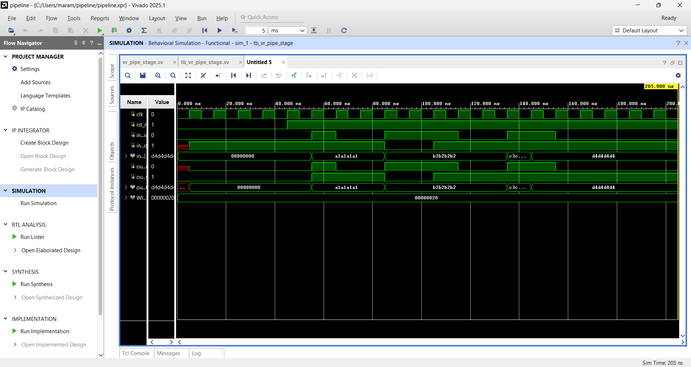

# Valid/Ready Pipeline Stage (SystemVerilog)

## Overview
This project implements a single-stage pipeline register using a standard valid/ready handshake protocol.

The module:
- Accepts data when `in_valid && in_ready`
- Outputs data with `out_valid`
- Handles backpressure correctly
- Supports simultaneous push and pop
- Resets to a clean empty state
- Fully synthesizable

## Interface

Upstream:
- in_valid
- in_ready
- in_data

Downstream:
- out_valid
- out_ready
- out_data

## Handshake Rule
A transfer occurs only when:
valid && ready

## Design Guarantees
- No data loss
- No data duplication
- Correct backpressure handling
- Clean reset behavior

## File
- vr_pipe_stage.sv

## Simulation Result

Behavioral simulation confirms:
- Proper valid/ready handshake
- Correct backpressure handling
- Simultaneous push & pop supported
- Clean reset behavior

